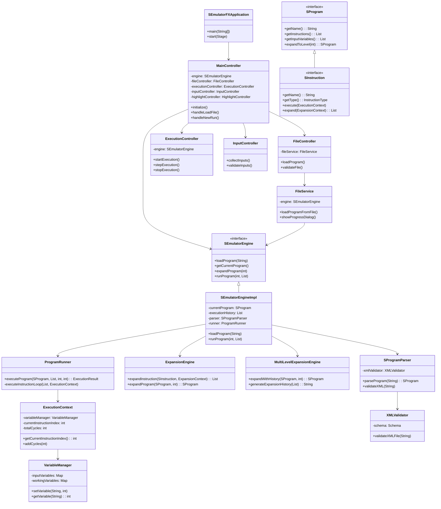

# S-Emulator Project

A modern JavaFX application for executing and debugging S-language programs with advanced expansion capabilities and visual debugging tools.

## Quick Start

1. **Run the Application**: Execute run.bat
2. **Load a Program**: Use File → Load Program File to select an XML file from the `EX 1` or `EX 2` folders
3. **Run the Program**: Click "New Run" and provide input values, then click "Start"
4. **Debug**: Use step-by-step execution to trace program behavior

## System Requirements

- **Java**: Java 21 or higher
- **Operating System**: Windows, macOS, or Linux
- **Maven**: For building the project

## User Manual

### Getting Started

**Launching the Application:**
```bash
./run.bat
```

The application will open in a modern JavaFX window with the following interface:

### Main Interface

**Menu Bar:**
- **File**: Load program files and exit the application
- **Theme**: Switch between Light, Dark, and High Contrast themes
- **View**: Toggle animations and visual effects
- **Help**: Access application information

**Top Controls:**
- **Load File Button**: Quick access to load XML program files
- **Current File Path**: Shows the currently loaded program
- **Program Function Selector**: Choose between different program functions
- **Level Selector**: Set expansion level for synthetic instructions
- **Highlight Selection**: Choose which instructions to highlight

**Main Content Area:**
- **Instructions Table**: Displays all program instructions with details
- **Variables Section**: Shows current variable values during execution
- **Execution History**: Lists all previous program runs and results

**Debug Controls:**
- **New Run**: Start a new program execution
- **Execution Mode**: Choose between normal and step-by-step execution
- **Start/Stop/Resume**: Control program execution
- **Step Over**: Execute one instruction at a time

### Working with Programs

**Loading Programs:**
1. Click "Load File" or use File → Load Program File
3. The program will be parsed and displayed in the instructions table

**Running Programs:**
1. Click "New Run" to start a new execution
2. Enter input values in the input fields (space-separated numbers)
3. Choose execution mode (Normal or Step-by-step)
4. Click "Start" to begin execution

**Debugging:**
- Use step-by-step mode to trace execution
- Watch variable values change in real-time
- View execution history for previous runs
- Use highlighting to focus on specific instructions

**Expansion Levels:**
- Set expansion level to convert synthetic instructions to basic ones
- Higher levels show more detailed instruction breakdown
- Use the level selector to explore different expansion depths

### Variable Types

- **Input Variables** (x1, x2, x3, ...): Hold input values
- **Work Variables** (z1, z2, z3, ...): Temporary variables used during execution
- **Output Variable** (y): Contains the final result

## Classes Overview

### System Architecture Diagram



## Technical Architecture

### Core Components

**Engine Module (`s-emulator-engine`):**
- **`SEmulatorEngine`** - Main engine interface with program loading, execution, and expansion capabilities
- **`SProgram`** - Represents S-language programs with instruction management
- **`SInstruction`** - Interface for individual instructions with execution and expansion methods
- **`ProgramRunner`** - Handles program execution with step-by-step debugging support
- **`ExpansionEngine`** - Converts synthetic instructions to basic instructions at multiple levels
- **`SProgramParser`** - Parses XML files into program objects with validation

**JavaFX UI Module (`s-emulator-fx`):**
- **`SEmulatorFXApplication`** - Main JavaFX application entry point
- **`MainController`** - Central controller managing all UI interactions and workflow
- **`FileController`** - Handles file loading operations with progress dialogs
- **`ExecutionController`** - Manages program execution and debugging controls
- **`InputController`** - Collects and validates user input for program execution
- **`FileService`** - Service layer for file operations and validation

### Key Features

- **Modern JavaFX Interface** - Intuitive GUI with themes, animations, and responsive design
- **Multi-Level Expansion** - Convert synthetic instructions to basic instructions at any depth
- **Step-by-Step Debugging** - Execute programs instruction by instruction with variable tracking
- **Real-Time Variable Monitoring** - Watch variable values change during execution
- **Execution History** - Track and review all previous program runs
- **XML Validation** - Automatic validation against S-Emulator schemas
- **Theme Support** - Light, dark, and high-contrast themes for accessibility

## Design Decisions

- **JavaFX Architecture** - Modern GUI framework providing rich user experience with themes and animations
- **MVC Pattern** - Clear separation between UI controllers, business logic, and data models
- **Factory Pattern** - Centralized instruction creation using Java 21 switch expressions
- **Multi-Level Expansion** - Sophisticated expansion system handling nested synthetic instructions
- **Service Layer** - Dedicated services for file operations and validation with progress feedback

## Repository

GitHub Repository: https://github.com/dorkokotek651/JavaS-Emulator
