# S-Emulator Project

## Bonus

Implemented the System State Save and Load bonus task.

## Decisions & Additional Info

### Decisions

1. **Factory Pattern with Switch Expression for Instruction Creation**
   - Implemented a centralized `InstructionFactory` using modern Java 21 switch expressions for instruction instantiation
   - This design eliminates complex if-else chains and provides a clean, maintainable way to create different instruction types
   - The factory encapsulates the creation logic and makes it easy to add new instruction types without modifying existing code

2. **Command Pattern for UI Operations**
   - Implemented a command pattern for all user interactions (`Command` interface with concrete implementations)
   - Each menu option corresponds to a specific command (`LoadFileCommand`, `RunProgramCommand`, etc.)
   - This design makes it easy to add new functionality and provides consistent error handling across all operations

3. **Multi-Level Expansion Engine Architecture**
   - Designed a sophisticated expansion system that can handle nested synthetic instructions
   - Implemented both single-level (`ExpansionEngine`) and multi-level (`MultiLevelExpansionEngine`) expansion capabilities
   - Maintains detailed ancestry tracking for expanded instructions, allowing users to see the complete expansion history

4. **Comprehensive State Management with Serialization**
   - Built a robust state management system using the State pattern with `SystemState` interface
   - Implemented JSON-based serialization for persisting and restoring complete system state
   - Designed to handle complex object graphs including programs, execution history, and internal counters

### Additional Information

- **Java 21 Compliance**: The entire project is built using Java 21 features and follows modern Java conventions
- **Input Validation**: Comprehensive input validation is implemented throughout the system with detailed error messages
- **Error Handling**: Robust exception hierarchy with specific exception types for different error scenarios
- **XML Schema Validation**: Programs are validated against the S-Emulator XML schema before processing
- **Execution Safety**: Built-in safeguards against infinite loops and malformed programs
- **Console Interface**: Clean, user-friendly console interface with formatted output and clear navigation
- **Maven Build System**: Standard Maven project structure with proper dependency management and build configuration

## Classes Overview

### System Architecture Diagram

```mermaid
classDiagram
    %% Engine Module - Core API
    class SEmulatorEngine {
        <<interface>>
        +loadProgram(String)
        +getCurrentProgram()
        +expandProgram(int)
        +runProgram(int, List)
        +saveState(String)
        +loadState(String)
    }
    
    class SEmulatorEngineImpl {
        -currentProgram: SProgram
        -executionHistory: List
        -parser: SProgramParser
        -runner: ProgramRunner
        +loadProgram(String)
        +runProgram(int, List)
    }
    
    class SProgram {
        <<interface>>
        +getName(): String
        +getInstructions(): List
        +getInputVariables(): List
        +expandToLevel(int): SProgram
    }
    
    class SProgramImpl {
        -name: String
        -instructions: List
        -inputVariables: List
        +expandToLevel(int): SProgram
    }
    
    class SInstruction {
        <<interface>>
        +getName(): String
        +getType(): InstructionType
        +execute(ExecutionContext)
        +expand(ExpansionContext): List
    }
    
    class BaseInstruction {
        <<abstract>>
        -name: String
        -type: InstructionType
        +execute(ExecutionContext)*
        +expand(ExpansionContext)*
    }
    
    %% Execution Components
    class ProgramRunner {
        +executeProgram(SProgram, List, int, int): ExecutionResult
        -executeInstructionLoop(List, ExecutionContext)
    }
    
    class ExecutionContext {
        -variableManager: VariableManager
        -currentInstructionIndex: int
        -totalCycles: int
        +getCurrentInstructionIndex(): int
        +addCycles(int)
    }
    
    class VariableManager {
        -inputVariables: Map
        -workingVariables: Map
        +setVariable(String, int)
        +getVariable(String): int
    }
    
    %% Expansion Components
    class ExpansionEngine {
        +expandInstruction(SInstruction, ExpansionContext): List
        +expandProgram(SProgram, int): SProgram
    }
    
    class MultiLevelExpansionEngine {
        +expandWithHistory(SProgram, int): SProgram
        +generateExpansionHistory(List): String
    }
    
    %% State Management
    class SystemState {
        <<interface>>
        +getCurrentProgram(): SProgram
        +getExecutionHistory(): List
        +getNextRunNumber(): int
    }
    
    class SystemStateSerializer {
        -objectMapper: ObjectMapper
        +saveToFile(SystemState, String)
        +loadFromFile(String): SystemState
    }
    
    %% UI Module
    class SEmulatorApplication {
        +main(String[])
        +run()
    }
    
    class MenuManager {
        -allCommands: List
        -ui: ConsoleInterface
        +runMainLoop(SEmulatorEngine)
        +displayMenu(SEmulatorEngine)
    }
    
    class ConsoleInterface {
        -scanner: Scanner
        -running: boolean
        +displayMenu(String, List)
        +getUserChoice(int, int): int
        +getFilePath(): String
    }
    
    class Command {
        <<interface>>
        +execute(ConsoleInterface, SEmulatorEngine)
        +getDescription(): String
        +isAvailable(SEmulatorEngine): boolean
    }
    
    class LoadFileCommand {
        +execute(ConsoleInterface, SEmulatorEngine)
        +getDescription(): String
    }
    
    class RunProgramCommand {
        +execute(ConsoleInterface, SEmulatorEngine)
        +getDescription(): String
    }
    
    class SaveStateCommand {
        +execute(ConsoleInterface, SEmulatorEngine)
        +getDescription(): String
    }
    
    %% XML Processing
    class SProgramParser {
        -xmlValidator: XMLValidator
        +parseProgram(String): SProgram
        +validateXML(String)
    }
    
    class XMLValidator {
        -schema: Schema
        +validateXMLFile(String)
    }
    
    %% Relationships
    SEmulatorEngine <|-- SEmulatorEngineImpl
    SProgram <|-- SProgramImpl
    SInstruction <|-- BaseInstruction
    Command <|-- LoadFileCommand
    Command <|-- RunProgramCommand
    Command <|-- SaveStateCommand
    
    SEmulatorEngineImpl --> SProgramParser
    SEmulatorEngineImpl --> ProgramRunner
    SEmulatorEngineImpl --> ExpansionEngine
    SEmulatorEngineImpl --> MultiLevelExpansionEngine
    SEmulatorEngineImpl --> SystemStateSerializer
    
    SProgramImpl --> SInstruction
    ProgramRunner --> ExecutionContext
    ExecutionContext --> VariableManager
    
    SEmulatorApplication --> MenuManager
    SEmulatorApplication --> SEmulatorEngineImpl
    MenuManager --> ConsoleInterface
    MenuManager --> Command
    
    SProgramParser --> XMLValidator
    SProgramParser --> SProgramImpl
```

### Engine Module (`s-emulator-engine`)

#### Core API Classes
- **`SEmulatorEngine`** - Main engine interface providing all emulator functionality
- **`SEmulatorEngineImpl`** - Concrete implementation of the engine interface
- **`SProgram`** - Interface representing an S-language program
- **`SProgramImpl`** - Implementation of S-language program with instruction management
- **`SInstruction`** - Interface for individual S-language instructions
- **`ExecutionResult`** - Contains results of program execution including variables and statistics
- **`SystemState`** - Interface for system state management and persistence

#### Instruction Processing
- **`BaseInstruction`** - Abstract base class for all instruction types
- **`InstructionFactory`** - Factory class for creating instruction instances
- **`InstructionType`** - Enum defining all supported instruction types

#### Execution Engine
- **`ProgramRunner`** - Handles program execution logic and instruction processing
- **`ExecutionContext`** - Manages execution state including variables and program counter
- **`VariableManager`** - Manages program variables and their values during execution

#### Expansion Engine
- **`ExpansionEngine`** - Handles single-level expansion of synthetic instructions
- **`MultiLevelExpansionEngine`** - Manages complex multi-level instruction expansion
- **`ExpansionContext`** - Provides context for instruction expansion operations

#### XML Processing
- **`SProgramParser`** - Parses XML files into S-language program objects
- **`XMLValidator`** - Validates XML files against the S-Emulator schema

#### State Persistence
- **`SystemStateSerializer`** - Handles serialization and deserialization of system state
- **`SystemStateImpl`** - Concrete implementation of system state
- **`SystemStateData`** - Data transfer object for JSON serialization

#### Exception Handling
- **`SProgramException`** - Base exception for all S-language related errors
- **`XMLValidationException`** - Specific exception for XML validation errors
- **`ExecutionException`** - Exception for program execution errors
- **`ExpansionException`** - Exception for instruction expansion errors
- **`StateSerializationException`** - Exception for state persistence errors

### UI Module (`s-emulator-ui`)

#### Application Entry Point
- **`SEmulatorApplication`** - Main class containing the application entry point

#### Console Interface
- **`ConsoleInterface`** - Handles all console input/output operations
- **`MenuManager`** - Manages menu display and user interaction flow
- **`OutputFormatter`** - Formats output text for consistent console presentation
- **`InputValidator`** - Validates user input and provides error feedback

#### Command Implementation
- **`Command`** - Interface defining the command pattern structure
- **`LoadFileCommand`** - Loads S-language programs from XML files
- **`ViewProgramCommand`** - Displays current program details
- **`ExpandProgramCommand`** - Expands synthetic instructions to specified levels
- **`RunProgramCommand`** - Executes programs with user-provided inputs
- **`ViewHistoryCommand`** - Shows execution history and results
- **`SaveStateCommand`** - Saves current system state to file
- **`LoadStateCommand`** - Loads previously saved system state
- **`ExitCommand`** - Handles application termination

## Team Information

**Student 1:**
- Name: Dor Kokotek
- ID: *******
- Email: dorko@mta.ac.il

**Student 2:**
- Name: Gilad Yavne 
- ID: *******

## Repository

GitHub Repository: https://github.com/dorkokotek651/JavaS-Emulator
