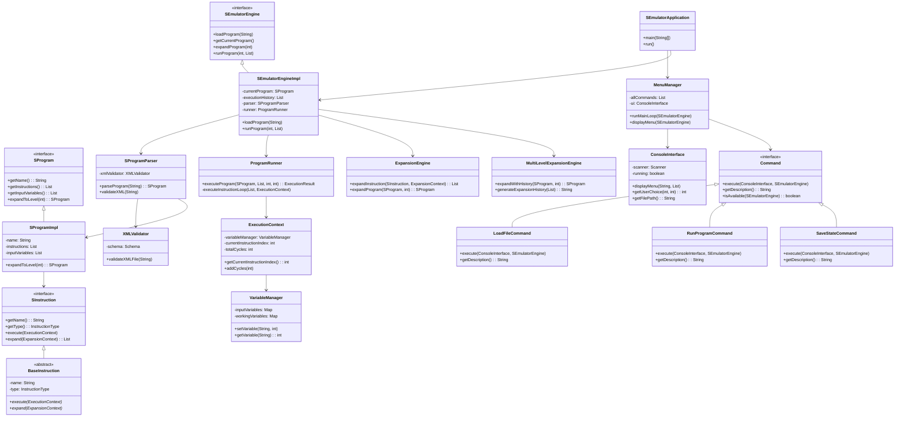

# S-Emulator Project

## Bonus

Implemented the System State Save and Load bonus task.

## Decisions & Additional Info

### Decisions

1. **Factory Pattern with Switch Expression for Instruction Creation**
   - Implemented a centralized `InstructionFactory` using modern Java 21 switch expressions for instruction instantiation
   - This design eliminates complex if-else chains and provides a clean, maintainable way to create different instruction types
   - The factory encapsulates the creation logic and makes it easy to add new instruction types without modifying existing code

2. **Command Pattern for UI Operations**
   - Implemented a command pattern for all user interactions (`Command` interface with concrete implementations)
   - Each menu option corresponds to a specific command (`LoadFileCommand`, `RunProgramCommand`, etc.)
   - This design makes it easy to add new functionality and provides consistent error handling across all operations

3. **Multi-Level Expansion Engine Architecture**
   - Designed a sophisticated expansion system that can handle nested synthetic instructions
   - Implemented both single-level (`ExpansionEngine`) and multi-level (`MultiLevelExpansionEngine`) expansion capabilities
   - Maintains detailed ancestry tracking for expanded instructions, allowing users to see the complete expansion history

4. **Advanced Debug and Execution Management**
   - Implemented comprehensive debug session management with step-by-step execution
   - Built robust execution history tracking with detailed variable state management
   - Designed to handle complex execution flows with proper state preservation

### User Manual

#### Quick Start
1. **Run the Application**: Double-click `run_s_emulator.bat` or run it from command line
2. **Load a Program**: Choose option 1 to load an S-language program from an XML file
3. **Run the Program**: Choose option 4 to execute the program with input values
4. **View Results**: The system displays execution results and maintains history

#### System Requirements
- **Java**: Java 21 or higher must be installed and accessible from PATH
- **Operating System**: Windows, macOS, or Linux

#### How to Use the Application

**Starting the Application**
Run the provided script: `run_s_emulator.bat`

**Main Menu Options:**
1. **Load XML File** - Load an S-language program from XML (example files in `EX 1` folder)
2. **View Current Program** - Display details about the loaded program
3. **Expand Program** - Convert synthetic instructions to basic instructions
4. **Run Program** - Execute the program with input values (space-separated numbers)
5. **View Execution History** - Show all previous program executions
6. **Save System State** - Save current state to JSON file
7. **Load System State** - Restore previously saved state
8. **Exit** - Close the application

**Input Format:**
- **XML Files**: Must follow S-Emulator schema (see `S-Emulator-v1.xsd`)
- **Program Input**: Space-separated numbers (e.g., `5 10 3` assigns x1=5, x2=10, x3=3)

**Variable Types:**
- **Input Variables** (x1, x2, x3, ...): Hold input values
- **Work Variables** (z1, z2, z3, ...): Temporary variables
- **Output Variable** (y): Contains final result

**Troubleshooting:**
- Ensure Java 21+ is installed and in PATH
- Use full file paths or enclose paths with spaces in quotes
- Validate XML files against the provided schema

## Classes Overview

### System Architecture Diagram

### Engine Module (`s-emulator-engine`)

#### Core API Classes
- **`SEmulatorEngine`** - Main engine interface providing all emulator functionality
- **`SEmulatorEngineImpl`** - Concrete implementation of the engine interface
- **`SProgram`** - Interface representing an S-language program
- **`SProgramImpl`** - Implementation of S-language program with instruction management
- **`SInstruction`** - Interface for individual S-language instructions
- **`ExecutionResult`** - Contains results of program execution including variables and statistics

#### Instruction Processing
- **`BaseInstruction`** - Abstract base class for all instruction types
- **`InstructionFactory`** - Factory class for creating instruction instances
- **`InstructionType`** - Enum defining all supported instruction types

#### Execution Engine
- **`ProgramRunner`** - Handles program execution logic and instruction processing
- **`ExecutionContext`** - Manages execution state including variables and program counter
- **`VariableManager`** - Manages program variables and their values during execution

#### Expansion Engine
- **`ExpansionEngine`** - Handles single-level expansion of synthetic instructions
- **`MultiLevelExpansionEngine`** - Manages complex multi-level instruction expansion
- **`ExpansionContext`** - Provides context for instruction expansion operations

#### XML Processing
- **`SProgramParser`** - Parses XML files into S-language program objects
- **`XMLValidator`** - Validates XML files against the S-Emulator schema

#### Exception Handling
- **`SProgramException`** - Base exception for all S-language related errors
- **`XMLValidationException`** - Specific exception for XML validation errors
- **`ExecutionException`** - Exception for program execution errors
- **`ExpansionException`** - Exception for instruction expansion errors

### UI Module (`s-emulator-ui`)

#### Application Entry Point
- **`SEmulatorApplication`** - Main class containing the application entry point

#### Console Interface
- **`ConsoleInterface`** - Handles all console input/output operations
- **`MenuManager`** - Manages menu display and user interaction flow
- **`OutputFormatter`** - Formats output text for consistent console presentation
- **`InputValidator`** - Validates user input and provides error feedback

#### Command Implementation
- **`Command`** - Interface defining the command pattern structure
- **`LoadFileCommand`** - Loads S-language programs from XML files
- **`ViewProgramCommand`** - Displays current program details
- **`ExpandProgramCommand`** - Expands synthetic instructions to specified levels
- **`RunProgramCommand`** - Executes programs with user-provided inputs
- **`ViewHistoryCommand`** - Shows execution history and results
- **`SaveStateCommand`** - Saves current system state to file
- **`LoadStateCommand`** - Loads previously saved system state
- **`ExitCommand`** - Handles application termination

## Team Information

**Student 1:**
- Name: Dor Kokotek
- ID: *******
- Email: dorko@mta.ac.il

**Student 2:**
- Name: Gilad Yavne 
- ID: *******
- Email: giladya2@mta.ac.il

## Repository

GitHub Repository: https://github.com/dorkokotek651/JavaS-Emulator
